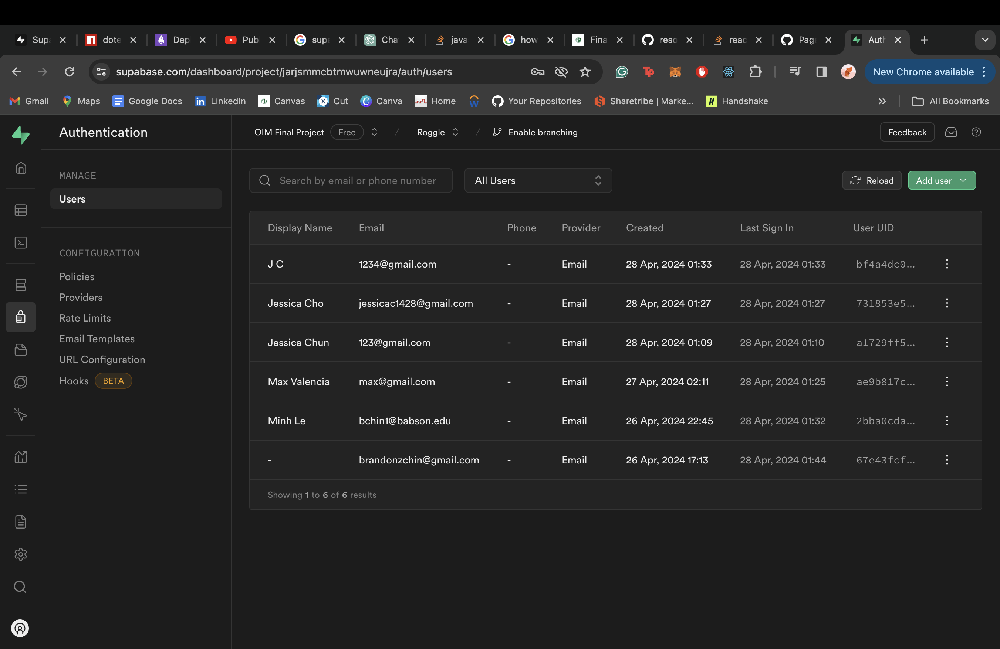
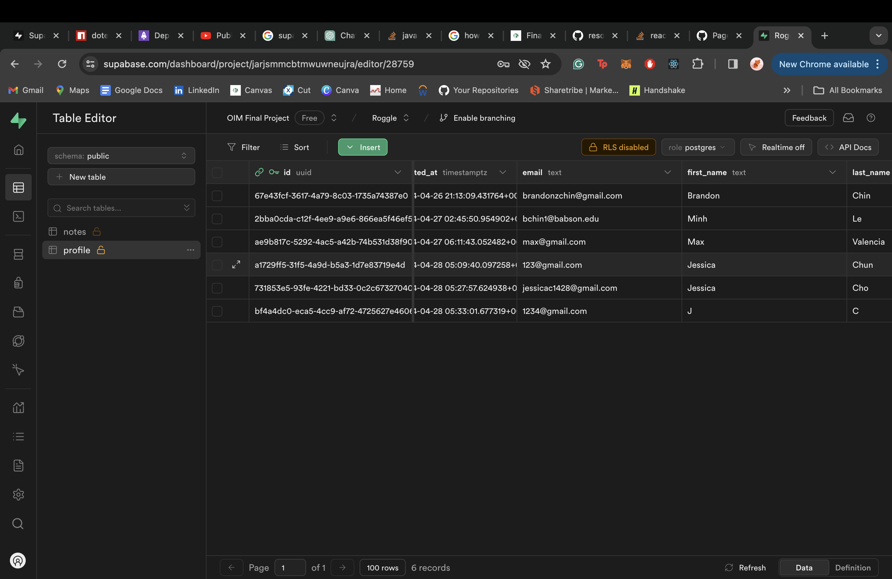

Developers: Brandon Chin

1. Project Overview
   A online notebook where you can easily store quick notes and access it anywhere on the web. All you need is your email and password to access it.

2. Usage Guidelines

    1. First create an account with the website. Or Login with an Account if you want. Here is my account login and details for testing purposes: Username - brandonzchin@gmail.com | Password - 1234. If you're creating an account, click the register button and fill in the necessary details.
    2. Once you're successful, you'll be redirected to dashboard page
    3. On the left handside you will be able to create your note and enter the specific fields. You are not required to submit all details but advised.
    4. Once you've submitted all details, it will rerender the post component and present you the information you wrote.
    5. You can delete the information with a delete button.

3. Dependencies
   "@supabase/supabase-js": "^2.42.7",
   "@testing-library/jest-dom": "^5.17.0",
   "@testing-library/react": "^13.4.0",
   "@testing-library/user-event": "^13.5.0",
   "dotenv": "^16.4.5",
   "react": "^18.3.0",
   "react-dom": "^18.3.0",
   "react-router-dom": "^6.23.0",
   "react-scripts": "5.0.1",
   "web-vitals": "^2.1.4"

4. Project Structure
   App.js acts as the build. It compliles the components and controls the routing of pages.

5. Collaboration Information (if applicable)
   ChatGPT, CO-PILOT, Supabase Documentation (even though they're heavily deprecated at times), W3Schools, Youtube Tutorials.

6. Acknowledgments
   Supabase API

7. Reflection
   When I first started this course, I gave myself a goal. 1. Polish up my foundations of coding. 2. Learn authentication. As a result, I picked a project idea that required authentication and database management.

    What went well was my the UX. I had a great time building and designing the frontend with react. It was fun designing and picking the colors coordination for the website. Famailiarity with useState, useEffect, I was able to get the components to react precisely the way I wanted.

    I had trouble with connecting with Supabase's API becuase it was my first time using Supabase. So as I was intergrating the database, I was learning it. In addition, it was my first time using a structured database. I really struggled with authentication and then connecting it to my profile table. I also then connected it to my notes table with held all the content for each user.

    Figuring out Protected Routes was also fun. I never used protected routes becuase it was my first login component. So figuring that out in React documentation was a fun process.

    Once I was done with that. One of the biggest problem, I was rerendering the components once new data had been fetched.

    BIGGEST PROBLEM DEPLOYMENT. I spent 2 hours figuring out why browserrouter doesn't work in deployment build but it works fine in development. Found out via Reddit that it uses Hashrouter. So I had to replace that and adjust all the routes.

    Going forward, I need to focus on database management and useEffect and passing functions in props. I know a broad sense of it from my online courses but I need to refine it becuase it took me awhile.

    ChatGPT helped me figure out what the error code meant and offered possible solutions to fix.

    Database screenshots:
    
    
