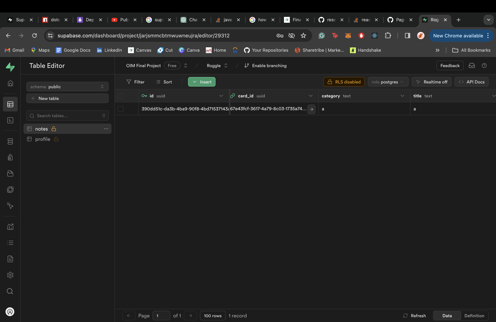
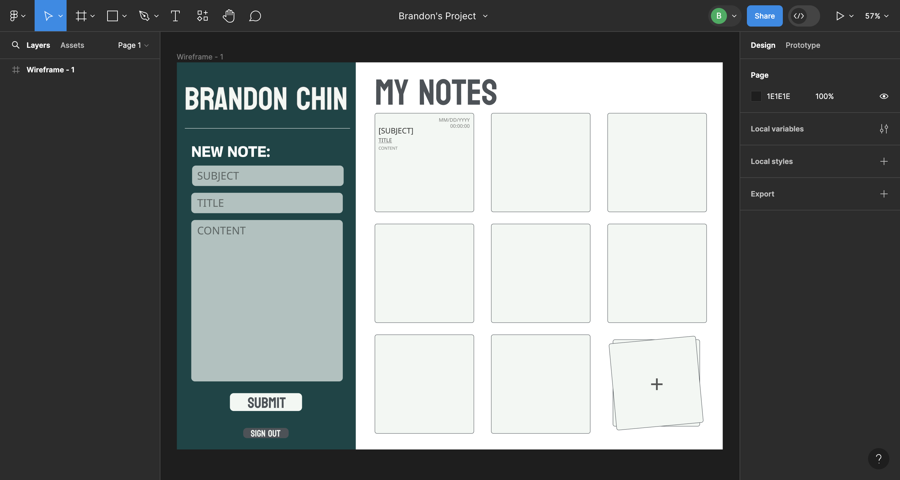

Developers: Brandon Chin

1. Project Overview
   A online notebook where you can easily store quick notes and access it anywhere on the web. All you need is your email and password to access it.

2. Usage Guidelines

    1. First create an account with the website. Or Login with an Account if you want. Here is my account login and details for testing purposes: Username - brandonzchin@gmail.com | Password - 1234. If you're creating an account, click the register button and fill in the necessary details.
    2. Once you're successful, you'll be redirected to dashboard page
    3. On the left handside you will be able to create your note and enter the specific fields. You are not required to submit all details but advised.
    4. Once you've submitted all details, it will rerender the post component and present you the information you wrote.
    5. You can delete the information with a delete button.

3. Dependencies
   "@supabase/supabase-js": "^2.42.7",
   "@testing-library/jest-dom": "^5.17.0",
   "@testing-library/react": "^13.4.0",
   "@testing-library/user-event": "^13.5.0",
   "dotenv": "^16.4.5",
   "react": "^18.3.0",
   "react-dom": "^18.3.0",
   "react-router-dom": "^6.23.0",
   "react-scripts": "5.0.1",
   "web-vitals": "^2.1.4"

4. Project Structure
   App.js acts as the build. It compliles the components and controls the routing of pages.

5. Collaboration Information (if applicable)
   ChatGPT, CO-PILOT, Supabase Documentation (even though they're heavily deprecated at times), W3Schools, Youtube Tutorials.

6. Acknowledgments
   Supabase API

7. Reflection
   In the past year, I've taken Problem Solving, WebTech, and now finally Computer Science. I love building things. So I guess this is one of my final projects as an undergraduate student. Thank you, professor. It's been a pleasure.

    Here is my reflection:

    When I first started this course, I gave myself two goals:

    Polish up my foundations of coding.
    Learn authentication.

    As a result, I picked a project idea that required authentication and database management.

    What went well was my UX. I had a great time building and designing the frontend with React. It was fun designing and picking the color coordination for the website. With familiarity with useState and useEffect, I was able to get the components to react precisely the way I wanted.

    I had trouble connecting with Supabase's API because it was my first time using Supabase. So as I was integrating the database, I was learning it. In addition, it was my first time using a structured database. I really struggled with authentication and then connecting it to my profile table. I also then connected it to my notes table which held all the content for each user. I had to use SQL Editor to manually create a trigger so that when a new user joins via Auth table, their information will also be populated into the profile table. That was a bit hard. I also discovered a quick plpsql in the documentation for the table function:

    BEGIN
    INSERT INTO public.profile (id, email, first_name, last_name)
    VALUES (new.id, new.email, new.raw_user_meta_data ->> 'first_name', new.raw_user_meta_data ->> 'last_name');
    RETURN new;
    END

    Figuring out Protected Routes was also fun. I never used protected routes because it was my first login component. So figuring that out in React documentation was a fun process. I was testing if can bypass the protected routes via URL changes. It didn't work. I was glad.

    Once I was done with that, one of the biggest problems was rerendering the components once new data had been fetched. I had to useEffect, react hook, to render when there is a change in a specific parameter (state or UI).

    I learned that through console.log(data.user), I can visualize the data supabase returns when you authenticate a user. There I found that websites hold an access token assigned to the user's session. So it doesn't require a fetch data every page. Once the user signs out, it removes the session and token.

    BIGGEST PROBLEM: DEPLOYMENT. I spent 2 hours figuring out why BrowserRouter doesn't work in the deployment build but it works fine in development. Found out via Reddit that it uses HashRouter. So I had to replace that and adjust all the routes.

    Going forward, I need to focus on database management, useEffect, and passing functions in props. I know a broad sense of it from my online courses but I need to refine it because it took me a while.

    ChatGPT helped me figure out what the error code meant and offered possible solutions to fix.

    Anyway. Thanks for the opportunity to do this project. It was really fun.

    Database screenshots:
     auth table -- supabase standard auth
     profile table -- handle user first name last name
     notes table -- handle user notes
     figma file -- for reference
